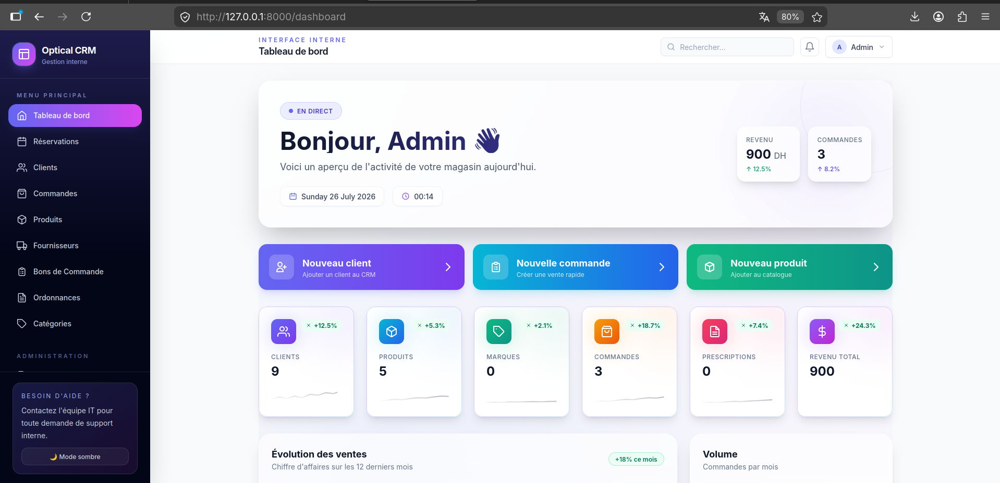
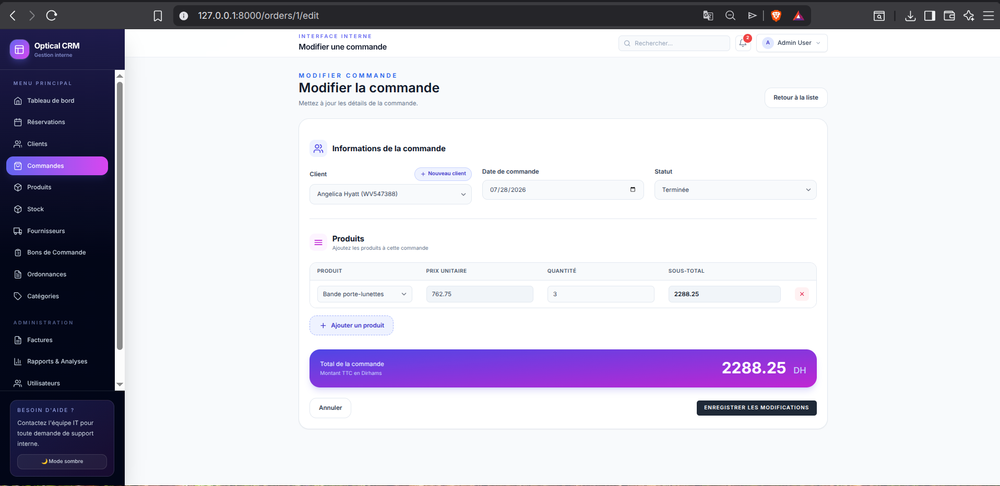
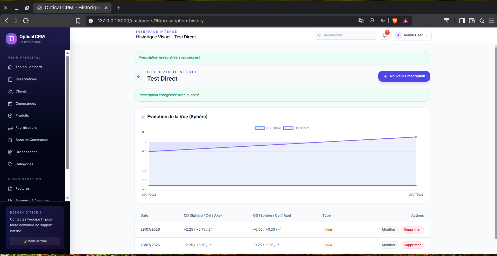
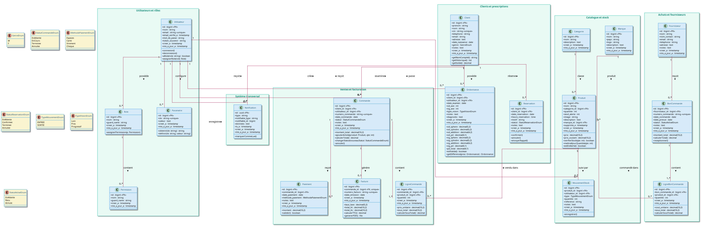
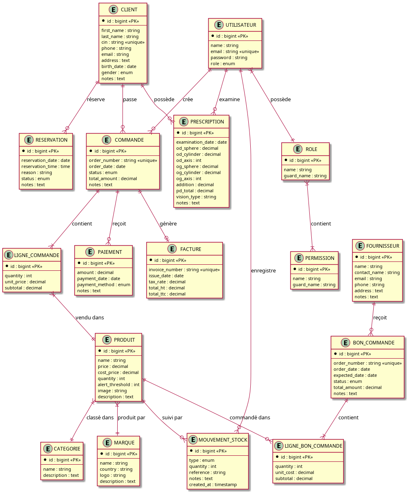

# Optical CRM Management System

A complete customer relationship management (CRM) web application built for optical stores. It manages customers, products, prescriptions, orders, payments, invoices, and stock operations from a single modern interface.

The project follows professional development practices including Docker containerization, CI/CD automation, and cloud-ready deployment.

---

## Table of Contents

- [Features](#features)
- [Technology Stack](#technology-stack)
- [Screenshots](#screenshots)
- [Getting Started](#getting-started)
- [Docker Setup](#docker-setup)
- [Project Structure](#project-structure)
- [CI/CD](#cicd)
- [License](#license)
- [Author](#author)

---

## Features

### Authentication & Roles
- User registration and login
- Profile management
- Role-based access control using Spatie Laravel Permission

Available roles:

- Admin
- Manager
- Employee

### Customer Management
- Create, update, and delete customers
- Search customers and CIN management
- Customer history tracking

### Product Management
- Products CRUD
- Categories and brands management
- Stock tracking

### Prescription Management
- Store customer prescriptions
- Track eye information
- Prescription history

### Order Management
- Create orders and manage order items
- Customer order history
- Automatic stock updates

### Payment Management
- Track payments and payment status
- Remaining balance calculation
- Payment follow-up

### Invoice Management
- Generate invoices
- Export invoices as PDF
- Invoice history

### Stock Management
- Stock entries and exits
- Stock movements history
- Low stock alerts

---

## Technology Stack

### Backend
| Technology | Description |
| --- | --- |
| Laravel 13 | PHP framework |
| PHP 8.5 | Backend language |
| MySQL 8 | Database |

### Frontend
| Technology | Description |
| --- | --- |
| Blade | Templating engine |
| Tailwind CSS | Styling |
| JavaScript | Client-side logic |
| Vite | Build tool |

### DevOps & Tools
| Technology | Description |
| --- | --- |
| Docker & Docker Compose | Containerization |
| GitHub Actions | CI/CD automation |
| Microsoft Azure | Cloud deployment |
| Git & GitHub | Version control |

---

## Screenshots

### Dashboard



### Orders



### Prescription History




### Database Diagrams




---

## Getting Started

### Prerequisites

Make sure you have one of the following installed on your machine:

- [Docker](https://www.docker.com/products/docker-desktop/) (recommended)
- PHP 8.5+, Composer, Node.js and npm (local development)

---

## Docker Setup (Recommended)

Docker is the quickest way to run the whole application (Laravel + MySQL + Mailpit) with a single command.

### 1. Clone the repository

```bash
git clone https://github.com/mohamedait-abbou/optical-management-system.git
```

> Alternative: clone from GitLab
> ```bash
> git clone git@gitlab.com:mohamed-ait-abbou-group/optical-crm_pro.git
> ```

### 2. Go inside the project

```bash
cd optical-management-system
```

### 3. Configure the environment

Copy the example environment file:

```bash
cp .env.example .env
```

Set the following values for Docker:

```env
DB_CONNECTION=mysql
DB_HOST=mysql
DB_PORT=3306
DB_DATABASE=optical_crm
DB_USERNAME=optical_user
DB_PASSWORD=secret
DB_ROOT_PASSWORD=root_secret
```

### 4. Build and start the containers

```bash
docker compose up --build
```

The following services will start:

| Service | URL |
| --- | --- |
| Laravel application | http://localhost:8000 |
| Mailpit (email testing) | http://localhost:8025 |
| MySQL | localhost:3306 |

### 5. Run migrations and seeders

In another terminal, inside the project:

```bash
docker compose exec app php artisan key:generate
docker compose exec app php artisan migrate --seed
```

> The application is ready. Open http://localhost:8000 in your browser.

### Useful Docker commands

Start in the background:

```bash
docker compose up -d
```

Stop the containers:

```bash
docker compose down
```

Check container status:

```bash
docker ps
```

View logs:

```bash
docker compose logs -f app
```

---

## Local Installation

If you prefer to run the application without Docker:

```bash
git clone https://github.com/mohamedait-abbou/optical-management-system.git
cd optical-management-system

composer install
cp .env.example .env
php artisan key:generate
php artisan migrate --seed
npm install
npm run dev
```

In a second terminal:

```bash
php artisan serve
```

The application will be available at http://127.0.0.1:8000.

---

## Project Structure

```
├── app/            # Application logic (controllers, models, services)
├── config/         # Configuration files
├── database/       # Migrations and seeders
├── public/         # Public assets and entry point
├── resources/      # Views (Blade), styles and scripts
├── routes/         # Route definitions
├── tests/          # Automated tests
├── screenshots/    # Project screenshots
├── Dockerfile      # PHP/Apache container definition
└── docker-compose.yml
```

---

## CI/CD

The project uses GitHub Actions to automate the following tasks:

- Dependency installation
- Laravel checks
- Automated testing

Workflow location: `.github/workflows/`

---

## License

This project is licensed under the [MIT License](LICENSE).

---

## Author

**Mohamed Ait Abbou**

Computer Science Student

- GitHub: [@mohamedait-abbou](https://github.com/mohamedait-abbou)
